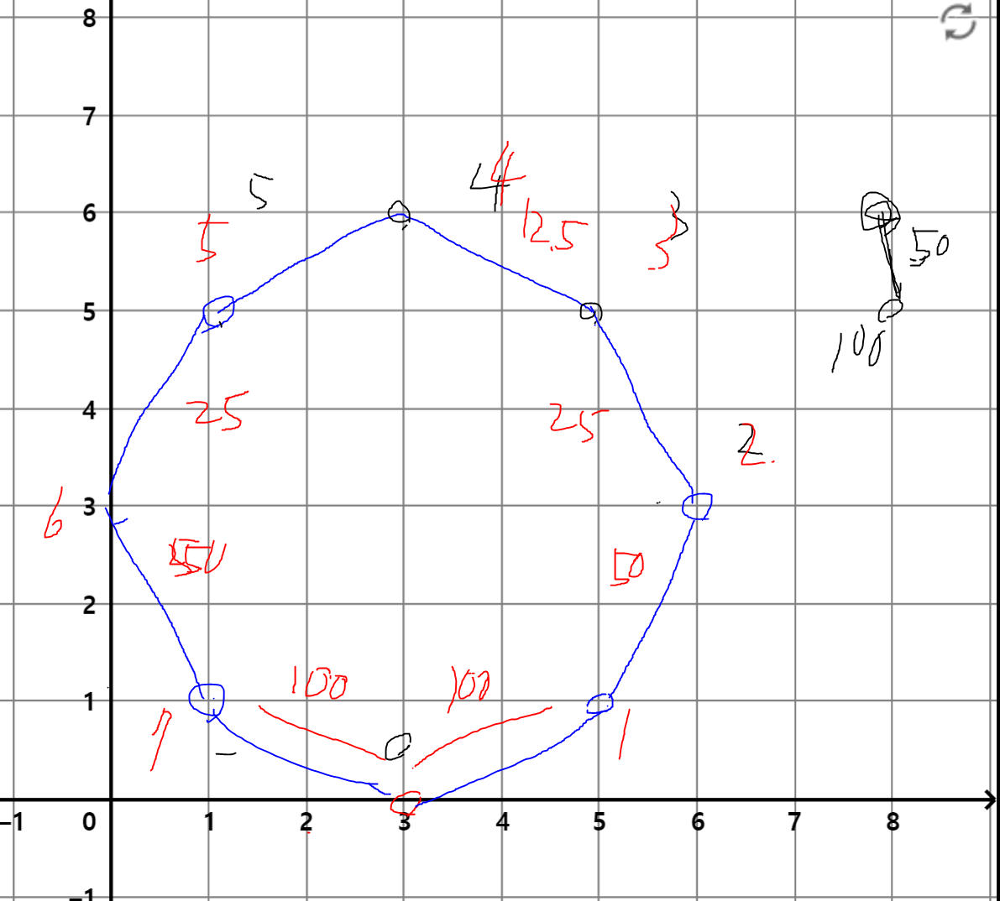

# 공격

## 해결 과정
### 0. A 탑이 B 탑으로 에너지 송신하는데 원하는 만큼의 절반을 깍고 송신된다.
### 1. 그러면 그리디하게 큰 에너지로 공격하고 싶으니까 결국 적이 공격받을 수 있는 타워가 많아야 한다.
### 2. 적의 위치부터 스타트 지점을 잡으면 되겠다.
### 3. 우선 각 타워에 대해서 송수신 되는 거리인지 조합 경우의 수 만큼 만든다.
### 4. 만들면서 쉽게 접근하기 쉽게 해시테이블을 가지고 인덱스 번호를 붙인다.
난 입력받으면서 빠르게 정리하였다.     
```python
for i in range(1, N + 1):
    x, y = map(int, input().split())
    arr.append([x, y])
    for j in range(i):
        if ((arr[i][0] - arr[j][0]) ** 2 + (arr[i][1] - arr[j][1]) ** 2) ** .5 <= R:
            Graph[i].append(j)
            Graph[j].append(i)
```
### 4. 적의 위치가 0번째에 있으므로 큐에 0를 삽입하고 큐 사이즈만큼 반복하면서 역추적 한다.
```python
while Queue:
    Qsize = len(Queue)
    for i in range(Qsize):
        cur = Queue.popleft()
        for next in Graph[cur]:
            if not visited[next]:
                visited[next] = True
                Queue.append(next)
                answer += D * size
    size /= 2
```
시작 지점에서 탐색 끝나면 송신 2배를 더 줄어든다.

### 5. 끝나면 answer를 소수점 2번째까지 출력하고 종료한다.
