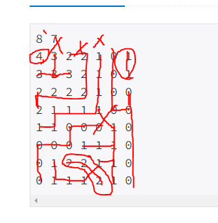

# 농장 관리
https://www.acmicpc.net/problem/1245
## 해결 과정
### 0. 인접한 방향이 4으로 잡고, 산봉우리만 탐지했더니 틀렸다.
### 1. 알고보니 인접한 방향이 8방향이더라.
### 2. 산봉우리만 탐지하기 위해서 가장 높은 값만 탐지하게 하면 된다.
### 3. 즉, 같은 값끼리 인접해도 산봉우리로 판단된다면 그것이 산봉우리다.

### 4. BFS로 인접한 높은 값이 있다면, 산봉우리가 아님을 판정한다.
### 5. 또는 같은값 끼리 인접한다면 방문처리 한다. 그래야 나중에 탐색할 횟수를 더 줄어준다.
### 6. 산봉우리 라면 1씩 증가, 아니라면 아무것도 안한다.
### 7. 출력.
